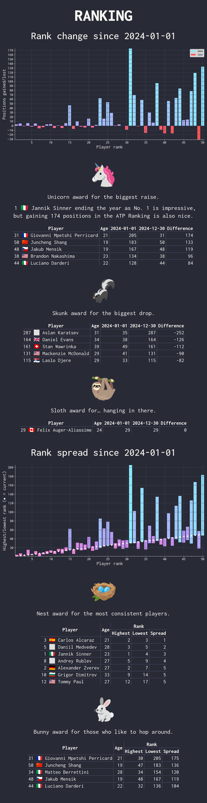
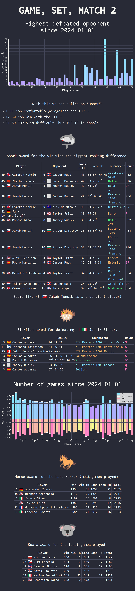
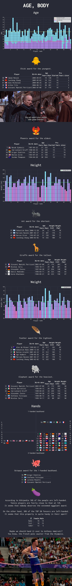
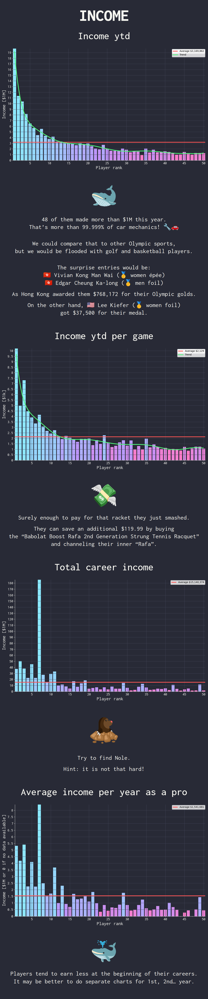
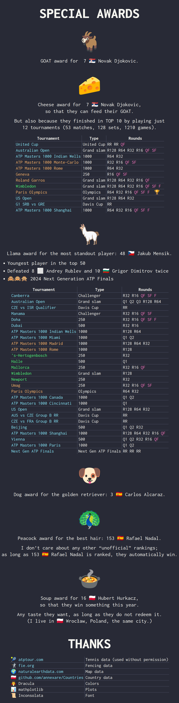

# How it works

1. Downloads data from the ATP (`Playwright`)
2. Generates graphs (`matplotlib`)
3. Fills `.html` templates (`Jinja2`)
4. Renders images (`Playwright`)

# Installation

1. `pip install -r requirements.txt`
2. Setup [Playwright](https://playwright.dev/), especially `PLAYWRIGHT_BROWSERS_PATH`
3. `python3 .`

# Result

